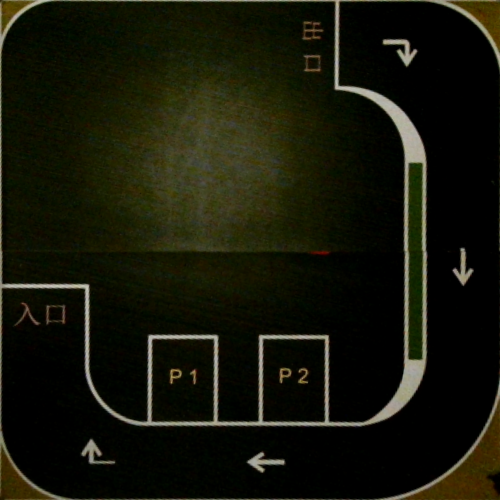

# parking
### Autonomous planning and control in parking scenario based on camera, ArUco markers and XBee
### Scenario

### Requirement
* Support up to 3 cars at the same time
* **The entire parking lot area should be included in the camera's field of view when initializing**
* **Initial positions and orientations are restricted.** Supported initial positions and orientations:
  * P1, up
  * P2, up
  * entrance, up 
  * exit, right 
### Usage
default:
```shell
roslaunch parking parking.launch
```
alternative:
```shell
roslaunch parking parking.launch cam:=0                  # camera id, e.g. 0, 1, 2, ...
                                 img_sz:=800             # image size, e.g. 500, 800, ...
                                 view_raw:=False         # view camera raw frame or not, True, False
                                 view_path:=True         # view map paths or not, True, False
                                 baud_rate:=115200       # XBee baud rate, e.g. 9600, 115200, ...
                                 view_contour:=True      # view map contours or not, True, False
                                 port:=/dev/ttyUSB0      # XBee port, e.g. /dev/ttyUSB0, COM1, ...
                                 ids:="['5', '6', '9']"  # XBee node (ArUco marker) ids (up to 3), e.g. "['5']", "['5', '6']", "['5', '6', '9']", ...
```